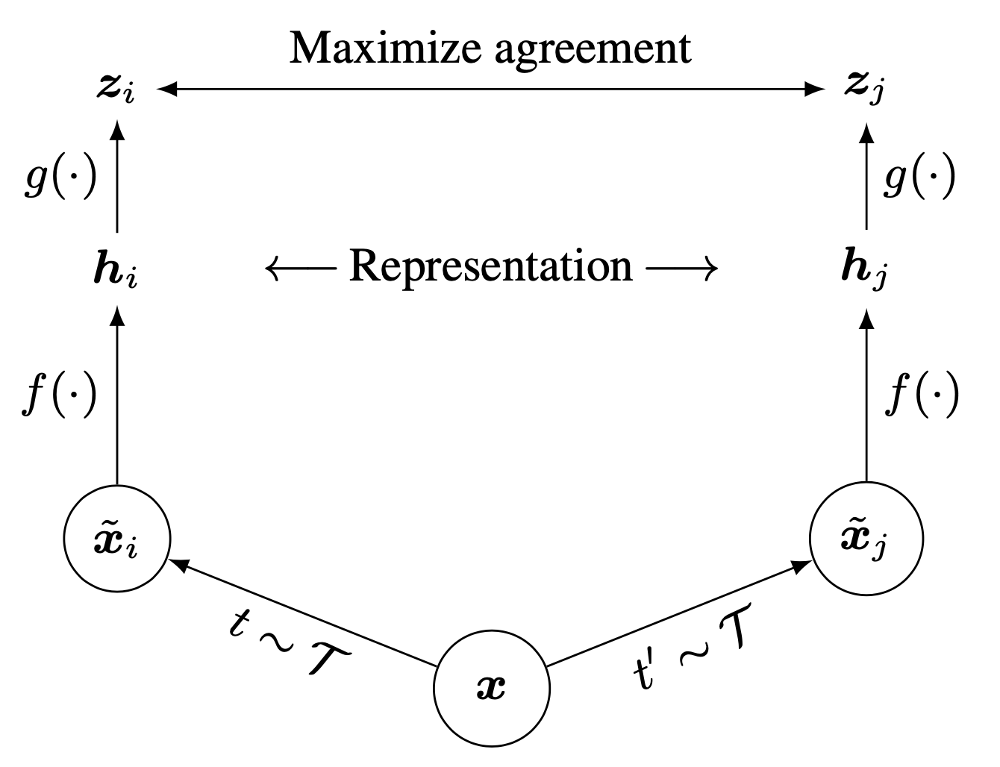

</img>

## SimCLR, in Pytorch

https://github.com/Spijkervet/SimCLR

## Install

```bash
$ pip install pytorch-lightning
```

## Usage

Use Single or Multi-GPU with Pytorch-lightning: 

```python
# Training
$ python train.py --image_folder /path/to/your/images

# Ckpt convert
$ python ckpt_convert.py --ckpt_path *.ckpt --save_path *.pth --arch resnet*
```

## Citation

```bibtex
@inproceedings{chen2020simple,
  title={A simple framework for contrastive learning of visual representations},
  author={Chen, Ting and Kornblith, Simon and Norouzi, Mohammad and Hinton, Geoffrey},
  booktitle={International conference on machine learning},
  pages={1597--1607},
  year={2020},
  organization={PMLR}
}
```
